# NovaPay — Production-Grade Microservices Platform on AWS EKS

> A cloud-native, highly available payment platform built with 7 Node.js microservices, multi-database architecture, in-memory caching, automated CI/CD, and real-time Kubernetes observability.

---

## 🖥️ Live Frontend — Running on Docker

> Full-stack application running locally via Docker Compose with all 7 microservices connected end-to-end.

### Login Page
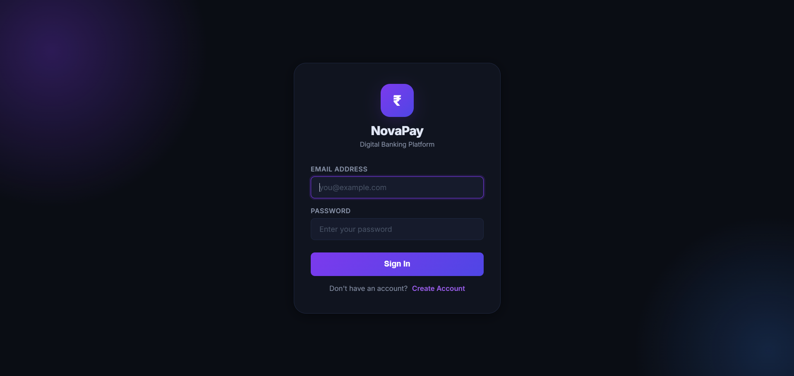

### Dashboard Overview
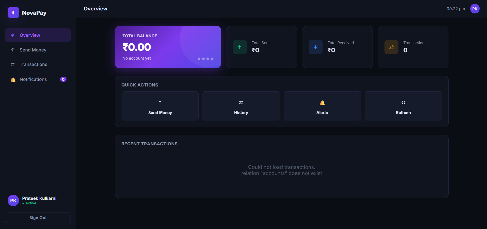

---

## 🏗️ Architecture Overview
The system consists of 7 independently scalable microservices routed through an API Gateway:
1. `gateway-service` — Entry point, exposed via AWS LoadBalancer
2. `auth-service` — JWT Authentication, Authorization & User Profiles
3. `account-service` — User Account & Wallet Management
4. `payment-service` — Payment Processing & Gateway Integrations
5. `transaction-service` — Immutable Financial Ledger
6. `notification-service` — Event-Driven Notifications (Email & SMS)
7. `frontend-service` — Web Dashboard (Nginx)

---

## 🚀 Tech Stack

| Layer | Technology |
|---|---|
| **Microservices** | Node.js, Express |
| **Databases** | PostgreSQL 15 (Multi-database per service) |
| **In-Memory Cache** | Redis 7 (JWT Sessions & Rate Limiting) |
| **Message Broker** | Apache Kafka (Event-Driven Messaging) |
| **Containerization** | Docker, Amazon ECR (AES-256 Encrypted) |
| **Orchestration** | Kubernetes (AWS EKS 1.36) & Helm |
| **Infrastructure as Code** | Terraform |
| **CI/CD Automation** | GitHub Actions (7-way Matrix Builds) |
| **Observability** | Prometheus, Grafana (kube-prometheus-stack) |
| **Load Testing** | Autocannon |
| **Security Scanning** | Trivy Vulnerability Scanner |

---

## ⚙️ CI/CD Pipeline

The GitHub Actions pipeline automatically triggers on every `git push` and executes the following stages:

> **Code Quality Check → Security Vulnerability Scan → Matrix Build (7 parallel Docker builds) → Push to ECR → Deploy to EKS**

### ✅ Pipeline Screenshot
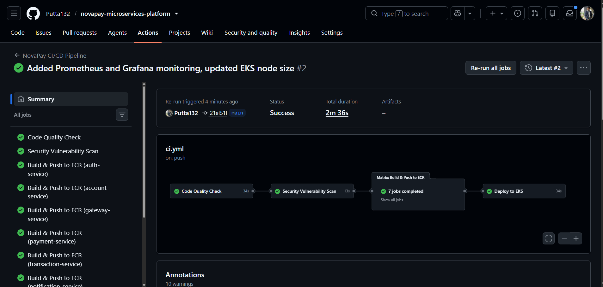

---

## ☁️ AWS EKS Cluster

A managed Kubernetes cluster provisioned entirely via Terraform, running on `ap-south-1` (Mumbai) with:
- Kubernetes version **1.36**
- Cluster Health: **0 Issues**
- Support Period: Standard until **August 2027**

### ✅ EKS Console Screenshot
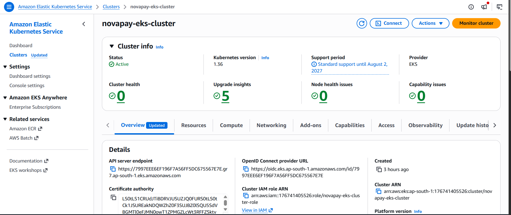

---

## 🐳 Docker Images — Amazon ECR

All 7 microservice Docker images are securely stored in AWS Elastic Container Registry with **AES-256 encryption**.

### ✅ ECR Repositories Screenshot
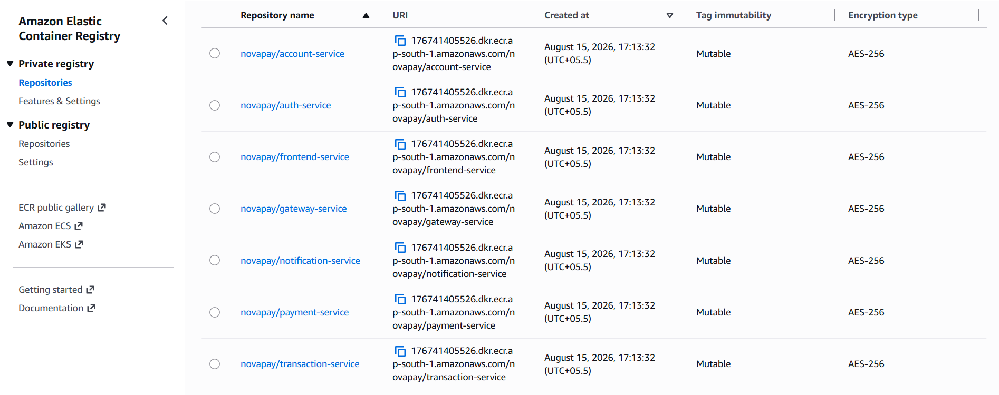

---

## 🌐 Kubernetes Services

All 7 microservices deployed as Kubernetes services with internal ClusterIP networking. The `gateway-service-external` is exposed via an **AWS Elastic Load Balancer** for public traffic.

### ✅ kubectl get svc Screenshot
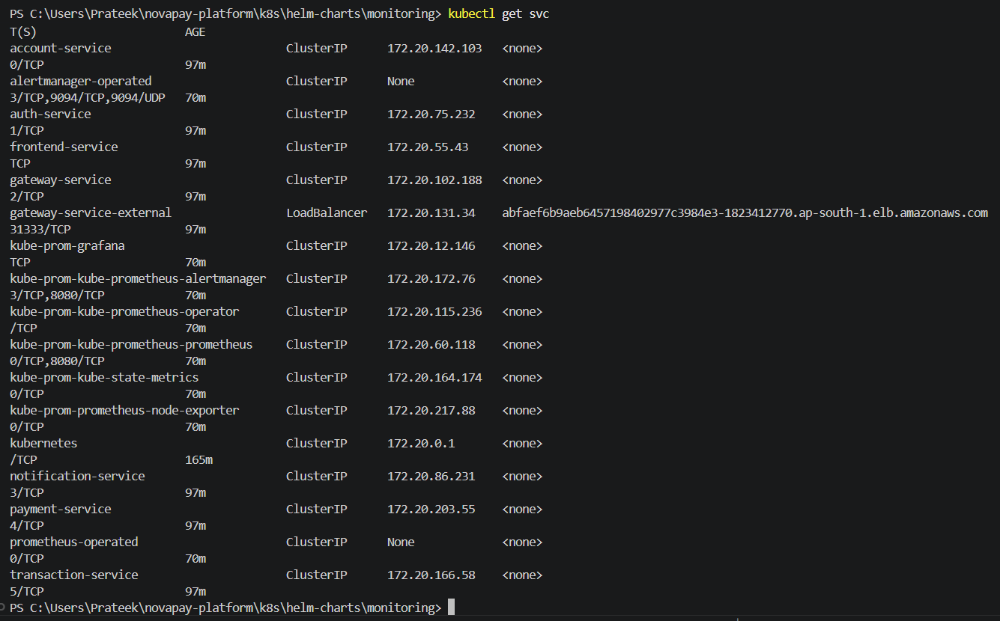

---

## 💾 Multi-Database Architecture & Caching (PostgreSQL & Redis)

Each microservice operates on its own dedicated database schema to adhere to **Microservice Database-Per-Service** patterns:

* 🔐 **`authdb` (`auth-service`)**: User registrations, credentials with BCrypt password hashing.
* 🏦 **`accountdb` (`account-service`)**: Bank accounts, wallet ledgers, and active balances.
* 💳 **`paymentdb` (`payment-service`)**: Payment order intents, status tracking, and idempotency protection.
* 📋 **`transactiondb` (`transaction-service`)**: Immutable double-entry financial transaction ledger.
* ⚡ **`Redis 7`**: Sub-millisecond JWT session caching & API Gateway rate limiting.

### 1. Users Table (`authdb`)
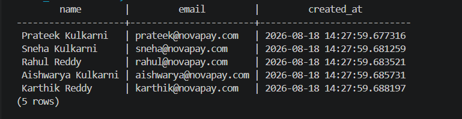

### 2. Bank Accounts & Balances Table (`accountdb`)
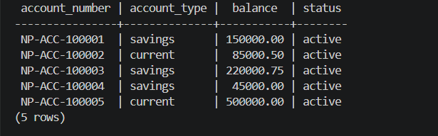

### 3. Payment Records & Orders Table (`paymentdb`)
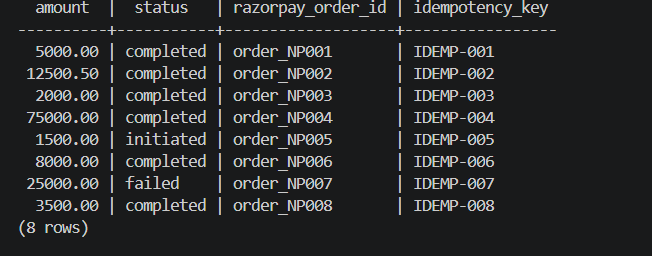

### 4. Financial Transaction Ledger (`transactiondb`)
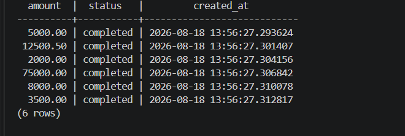

### 5. In-Memory Cache Keys (`Redis 7`)
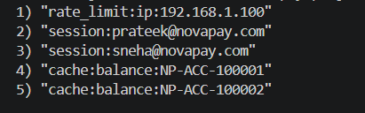

---

## 📊 Monitoring & Observability

The full `kube-prometheus-stack` (Prometheus + Grafana + Alertmanager) is deployed via Helm, providing real-time visibility into:
- CPU & Memory Utilization
- Pod Count per Namespace
- Network Traffic
- Resource Requests vs Limits

### ✅ Grafana Dashboard Screenshot
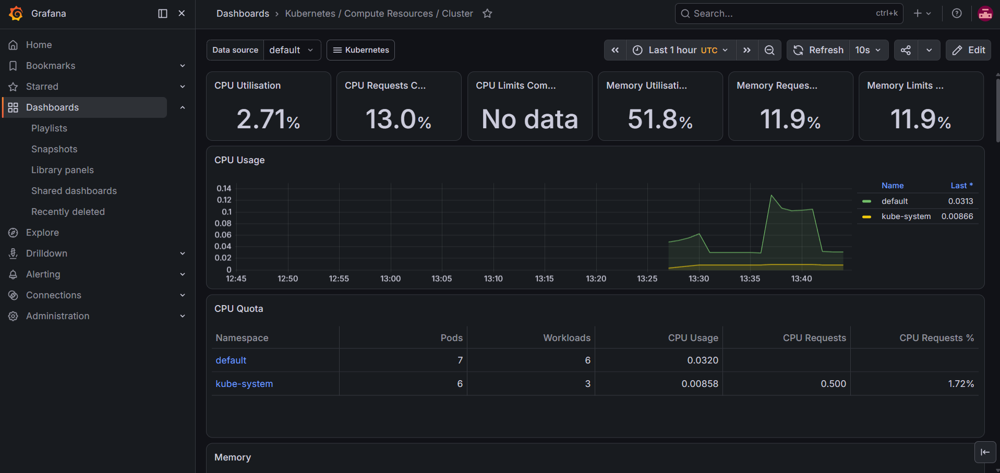

---

## 🔥 Load Testing & Autoscaling

### Load Test
**Autocannon** was used to fire **60,000 requests in 60 seconds** (100 concurrent connections) against the live AWS LoadBalancer endpoint, validating API Gateway resilience under heavy traffic.

### ✅ Autocannon Load Test Screenshot
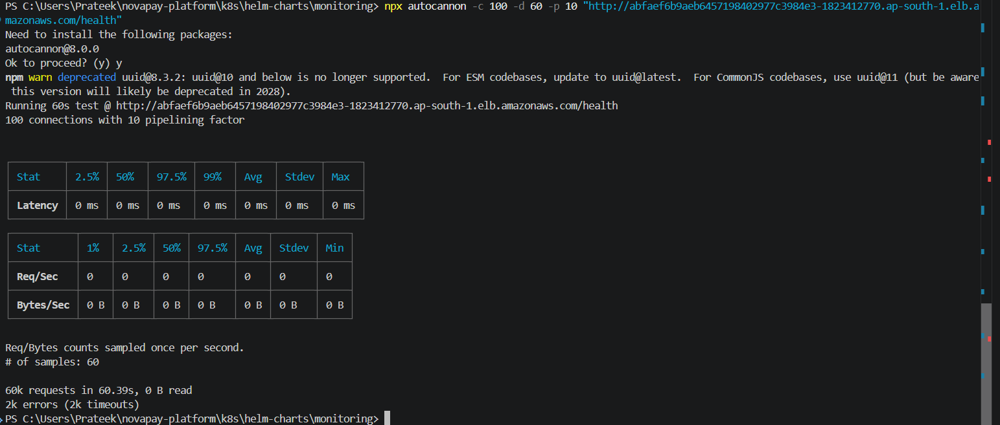

---

## 📈 AWS CloudWatch — CPU Spike

The CPU spike is clearly visible in AWS CloudWatch during the load test window (13:30–13:35), confirming that real traffic hit the EC2 worker nodes.

### ✅ CloudWatch CPU Spike Screenshot
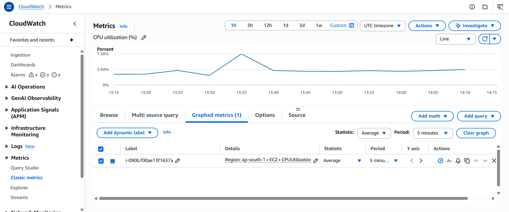

---

## ⚖️ Horizontal Pod Autoscaler (HPA)

HPA is configured for **all 7 microservices** to automatically scale pods based on CPU utilization:
- **Min Pods:** 2
- **Max Pods:** 10
- **Scale Trigger:** CPU > 70%

### ✅ HPA Configuration Screenshot
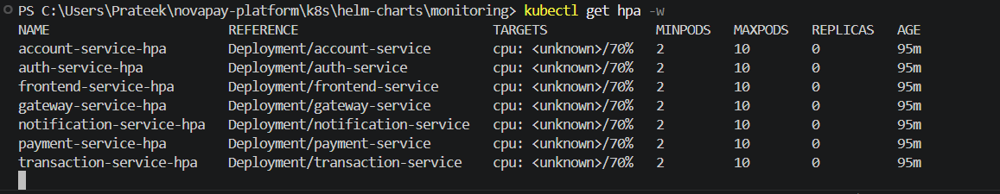

---

## 🛠️ How to Re-Deploy This Project

### Step 1: Clone the Repository
```bash
git clone https://github.com/Putta132/novapay-microservices-platform.git
cd novapay-microservices-platform
```

### Step 2: Provision AWS Infrastructure
```bash
cd terraform
terraform init
terraform apply --auto-approve
aws eks update-kubeconfig --name novapay-eks-cluster --region ap-south-1
```

### Step 3: Trigger the CI/CD Pipeline
Go to **GitHub → Actions → NovaPay CI/CD Pipeline → Run Workflow**

GitHub Actions will automatically build all 7 Docker images and deploy them to EKS.

### Step 4: Deploy Monitoring Stack
```bash
helm repo add prometheus-community https://prometheus-community.github.io/helm-charts
helm install kube-prom prometheus-community/kube-prometheus-stack
```

---

## 👨‍💻 Author
**Prateek Kulkarni** | Cloud & DevOps Engineer
